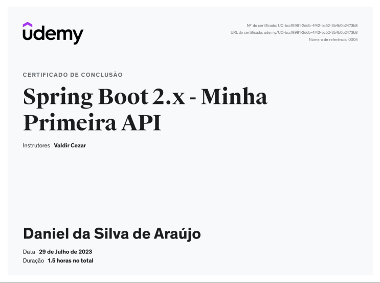
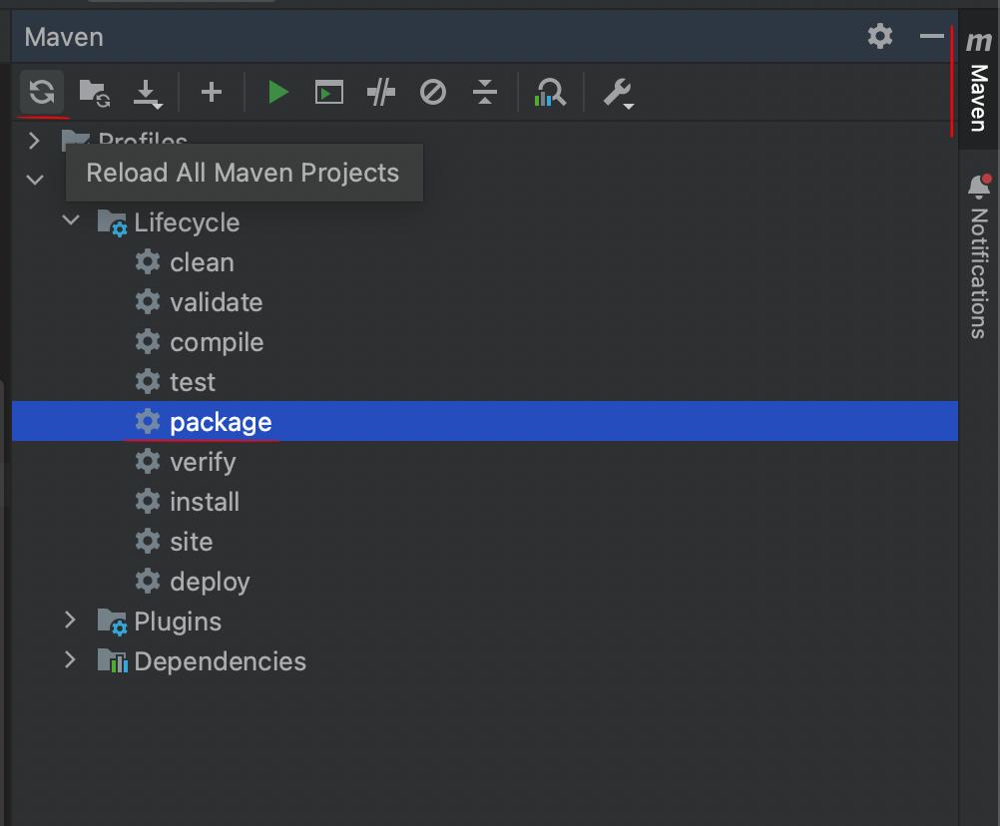
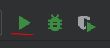

<h1>My first API</h1>

Este é um projeto de estudo de um curso da [Udemy](https://www.udemy.com/) visando obter conhecimento de CRUD utilizando Java Spring Boot



<p align="center">
  <a href="#pre-requisites">Pré-requisitos</a> •
  <a href="#como-usar">Instalando o projeto</a> •
</p>

 Tecnnologia utilizada **Java Spring e Spring MVC** para criação do servidor, **Spring Data JPA** para manipulação e persistência de dados e H2 Driver para realizar a conexão com banco de dados H2.

<h2 id="pre-requisites">💻 Requisitos</h2> 

Para rodar esse projeto você precisa ter o Java instalado na sua máquina.

<h2 id="como-usar"> 🚀 Instalando o projeto</h2>

Primeiro você deve clonar o repositório,

```bash
# Clone o repositório
$ git clone https://github.com/techdonne/my-first-api.git

# Acesse-o
$ cd my-first-api
```

Agora, dentro do IntelliJ, vamos instalar as depedências com o Maven



E por fim, entre no arquivo da classe `MyApiApllication` para executar o projeto



